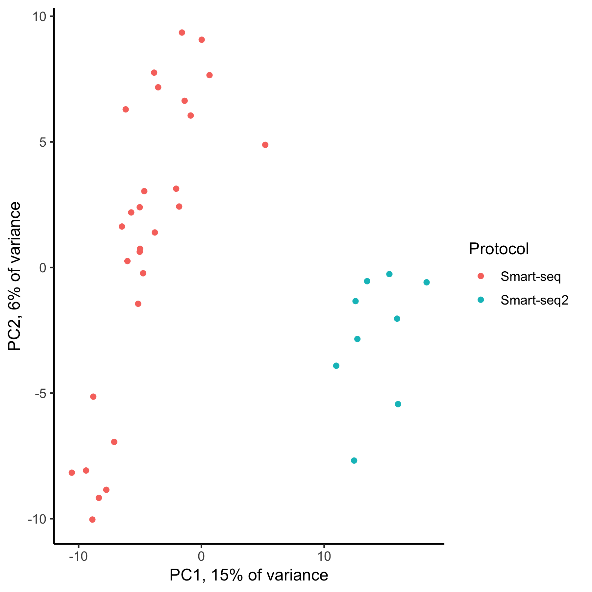

% NRG paper figures

This repository contains scripts to recreate the figures from the NRG paper.

### Required R libraries

```{r}
library(SingleCellExperiment)
library(scater)
library(statmod)
library(pheatmap)
library(TSCAN)
library(destiny)
library(corrplot)
library(igraph)
library(cccd)
library(Matrix)
library(cowplot)
library(ggplot2)
library(ggthemes)
library(ggbeeswarm)
library(GGally)
library(RColorBrewer)
library(network)
library(sna)
library(intergraph)
library(dendextend)
```

### Fig. 1
[script](fig1.R)  
[pdf](pdf/fig1.pdf)  
[png](png/fig1.png)  


### Fig. 2
[script](fig2.R)  
[pdf](pdf/fig2.pdf)  
[png](png/fig2.png)  


### Fig. 3
[script](fig3.R)  
[pdf](pdf/fig3.pdf)  
[png](png/fig3.png)  


### Fig. 4
[script](fig4.R)  
[pdf](pdf/fig4.pdf)  
[png](png/fig4.png)  


### Fig. 5
[script](fig2.R)  
[pdf](pdf/fig5.pdf)  
[png](png/fig5.png)  


